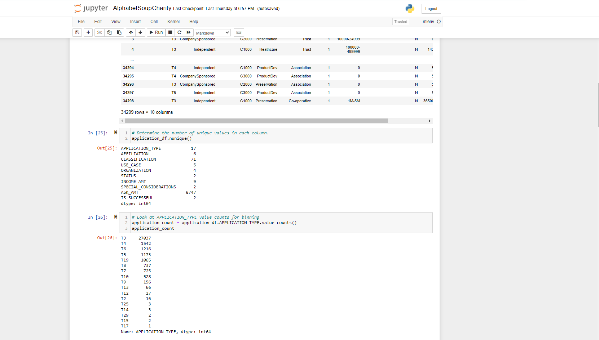
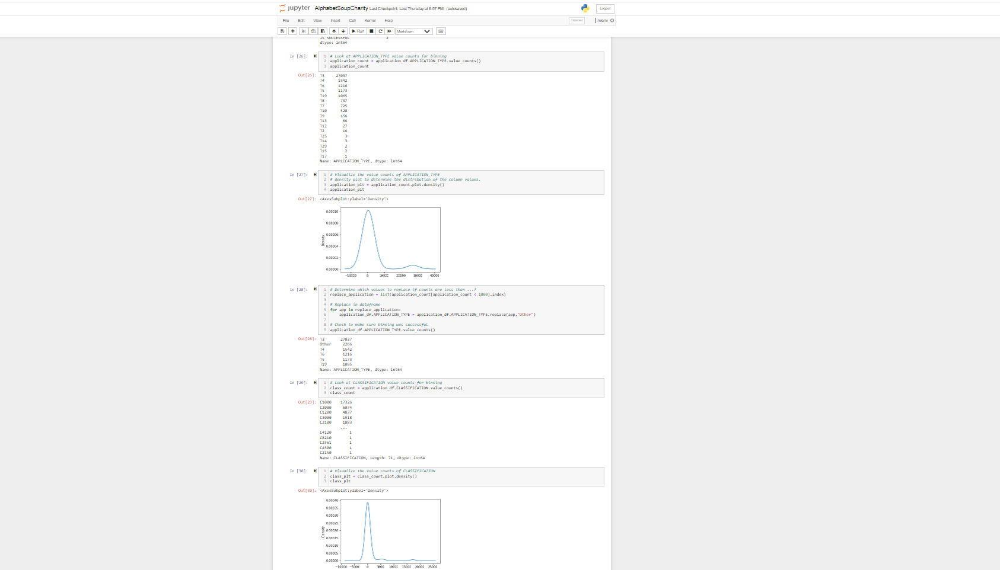

# Charity_Analysis 

- Resources: Machine learning and neural networks

# Overview:

- Charity Dataset - this dataset are a number of columns that capture metadata about each organization, such as the following:

-EIN and NAME—Identification columns

-APPLICATION_TYPE—Alphabet Soup application type

-AFFILIATION—Affiliated sector of industry

-CLASSIFICATION—Government organization classification

-USE_CASE—Use case for funding

-ORGANIZATION—Organization type

-STATUS—Active status

-INCOME_AMT—Income classification

-SPECIAL_CONSIDERATIONS—Special consideration for application

-ASK_AMT—Funding amount requested

-IS_SUCCESSFUL—Was the money used effectively

# Sponsor: 

- Alphabet Soup

# Project Manager:

- Nayan Patel

# Project Scope:

- Creating a binary classifier that is capable of predicting whether applicants will be successful if funded by Alphabet Soup.

- Deliverables:

-Deliverable 1: Preprocessing Data for a Neural Network Model

-Deliverable 2: Compile, Train, and Evaluate the Model

-Deliverable 3: Optimize the Model

# Data Preprocessing:

Charity data variable(s) are considered the target(s) for this model

EIN, NAME and IS_Successful are neither targets nor features, and removed 

Compiling, Training, and Evaluating the Model- attached image in Deliverable 2

it was 75/30 distribution for neurons, 3 layers, and activation functions selected for 
your neural network model to get up to 75% accuracy core

achived accuracy score was ~73%

steps taken to try and increase model performance were changing neurons and changing models that can hel to get to 75% accuracy

Summary:

This analysis by machine lerning gives us a view of trends in customer behavior and business operational patterns,

One important aspect of these deep learning models is that they can automatically learn hierarchical feature representations. This means that features computed by the first layer are general and can be reused in different problem domains, while features computed by the last layer are specific and depend on the chosen dataset and task.

comparing the performance of different classifiers on top of deep neural networks requires further investigation. 

The first solution that we present is based on fully-connected layers. This classifier adds a stack of fully-connected layers that is fed by the features extracted.

Results:

Validation accuracy is around 0.73, which is encouraging given the size of the dataset.

The model strongly overfits looking at results

Since we already used dropout, we should increase the size of the dataset to improve the results.
